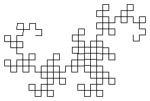
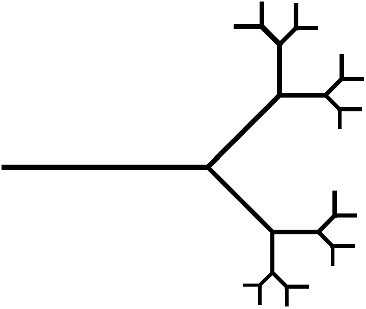
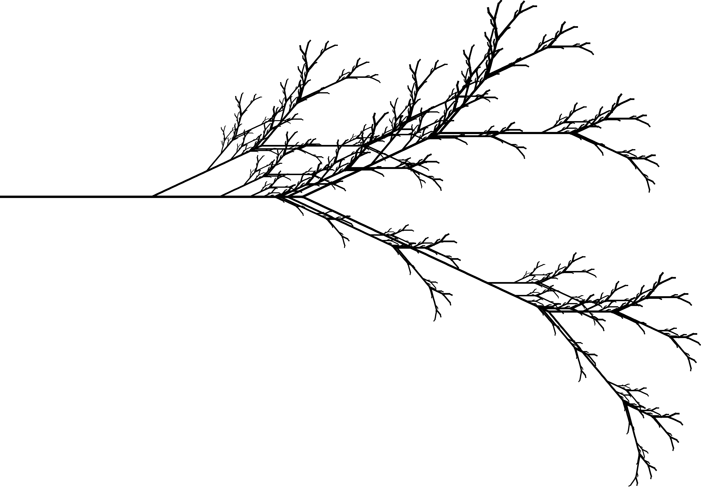
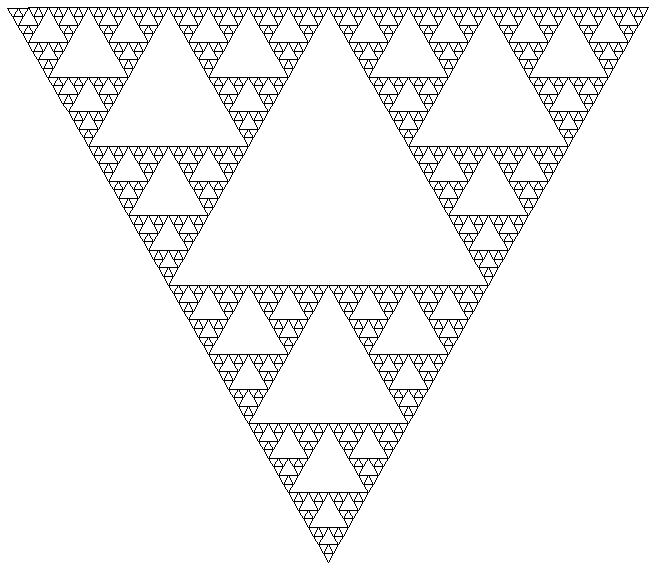

# Turtle System

A simple application that parses L-System definitions, iterates them, and uses turtle drawing to produce a procedurally generated output.

## Examples

_Dragon Curve (n = 8)_

```text
SYMBOL F { FORWARD(10) }
SYMBOL RL { ROTATE(90) }
SYMBOL RR { ROTATE(-90) }

RULE X -> { X RR Y F RR }
RULE Y -> { RL F X RL Y }

START { F X }
```



_Fractal Binary Tree (n = 4)_

```text
SYMBOL A { WIDTH(10 - stack_size); FORWARD ( (10 - stack_size) * 5) }
SYMBOL B { WIDTH(10 - stack_size); FORWARD ( (10 - stack_size) * 5) }
SYMBOL PU { PUSH; ROTATE(45) }
SYMBOL PO { POP; ROTATE(-45) }

RULE A -> { A A }
RULE B -> { A PU B PO B }

START { B }
```



_Fractal Plant (n = 6)_

```text
SYMBOL F { WIDTH( max (2, 10 - stack_size) * 2 ); FORWARD( max (4, (10 - stack_size) * 4 ) ) }
SYMBOL A { ROTATE(25) }
SYMBOL B { ROTATE(-25) }
SYMBOL S { PUSH }
SYMBOL T { POP }
SYMBOL Q { WIDTH(10) }

RULE X -> { F B S S X T A X T A F S A F X T B X }
RULE F -> { F F }

START { Q X }
```



_Sierpinski triangle (n = 6)_

```text
SYMBOL ROTRIGHT { ROTATE(-120) }
SYMBOL ROTLEFT { ROTATE(120) }
SYMBOL F { FORWARD(10) }
SYMBOL G { FORWARD(10) }

RULE F -> { F ROTLEFT G ROTRIGHT F ROTRIGHT G ROTLEFT F }
RULE G -> { G G }

START { F ROTLEFT G ROTLEFT G }
```



## Usage

1. To run the tool, you will require **Java 11 runtime**. I personally use _AdoptOpenJDK 11_ for testing and development, but any JVM should work.
2. Download the latest release from the `Releases` tab
3. Rename the downloaded JAR file to `turtle-system.jar`
4. You can run the JAR file by executing `java -jar turtle-system.jar -i <input turtle filename> -o <output image filename> -c <iteration count>` command in a shell

## TurtleSystem language

In the turtle system language, you can define 3 things:

* **Symbols** are the variables in the L-System that should have some drawing action associated with them.
* **Rules** are the replacement rules for each iteration
* **Start** is the starting state of the system

You can define _symbols_ using the following syntax:

```text
SYMBOL <Name of the symbol> { <Drawing commands> }
```

The `<Name of the symbol>` may contain letters, digits or underscores. The commands in the `<Drawing commands>` list must be separated by `;` characters. If you only write a single command, and in case of the last command in the list, the `;` may be ommited.

You can define _rules_ using any of the following syntaxes:

```text
RULE <Symbol to match> -> { <Outcome> }
RULE <Symbol to match> [<Probability>] -> { <Outcome> }
```

The `<Outcome>` is the list of symbols to produce from the left hand side, separated by whitespaces. You may define multiple outcomes for any given symbol, and the system becomes stochastic, using the value of `<Probability>` entered to choose exactly one outcome when iterating.

Finally, you can define the starting state of the L-System using the following syntax:

```text
START { <Symbols> }
```

The `<Symbols>` part is the whitespace separated list of symbols that gives the starting state of the L-System.

### Drawing commands

When drawing, you control a so-called "turtle"; this turtle has a position, a rotation, and remembers the color of the line its drawing, the width of it, as well as if drawing is currently enabled at all. If the pen of the turtle is **down**, that means that when moving the turtle, a new line will be drawn, and the opposite is true if the pen of the turtle is **up**.

When specifying drawing commands that take parameters, you can use mathematical expressions too, such as `stack_size * 4`. These expressions are evaluated as double-precision floating point numbers.

The turtle knows the following commands:

* `FORWARD(pixels)`: Move the turtle in the direction it's facing by some pixels
* `BACKWARD(pixels)`: Move the turtle opposite to the direction it's facing by some pixels
* `LEFT(pixels)`: Move the turtle to the left of the direction it's facing by some pixels
* `RIGHT(pixels)`: Move the turtle to the right of the direction it's facing by some pixels
* `ROTATE(degrees)`: Rotate the turtle by some degrees. Positive rotation indicates the turtle should be rotated in the **left** direction, negative is **right**. The turtle starts with a rotation of `0`, and is facing along the positive _X axis_
* `WIDTH(line width)`: Set the line width to some value (in pixels)
* `UP`: Lift the pen of the turtle (disable drawing)
* `DOWN`: Put the pen back to the drawing board (enable drawing)
* `PUSH`: Save the current state of the turtle to the top of the stack
* `POP`: Restore the previously saved state of the turtle, and remove the top of the stack. NOTE: Does not do anything if the stack was already empty!

## TODO

This project is a work-in-progress, and more of a proof-of-concept, mainly focusing on trying out plant generation using L-Systems, as well as how to design a "programming language". Some features that have not yet been implemented, but are planned:

* CI/CD for the project
* `COLOR` drawing command
* Affine transformation stack for the turtle
* (in the far future) 3D turtle drawing
* Error handling, better documentation